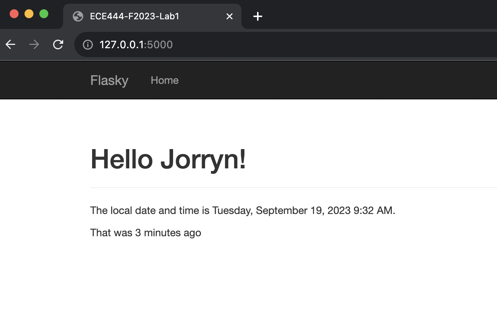
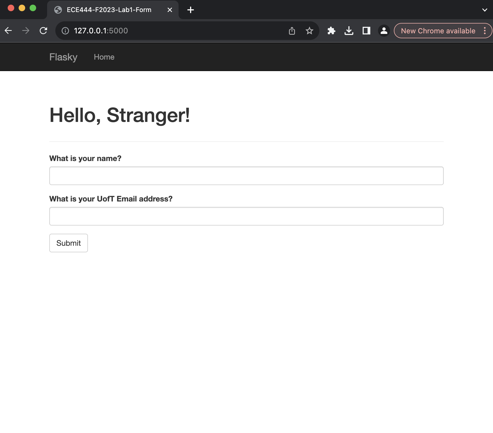
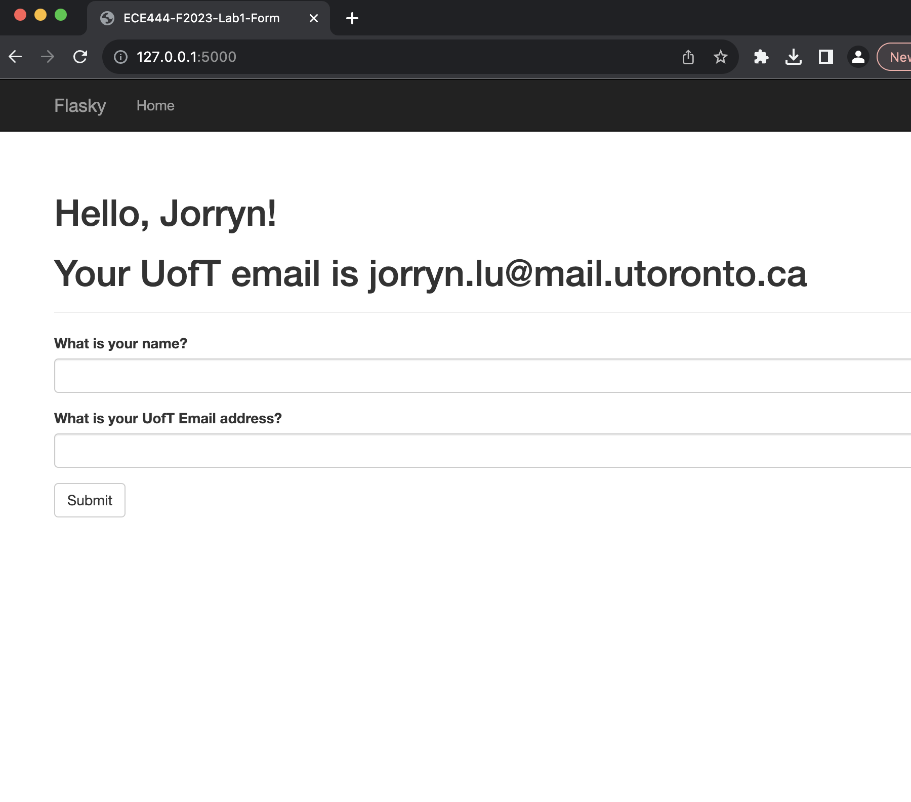
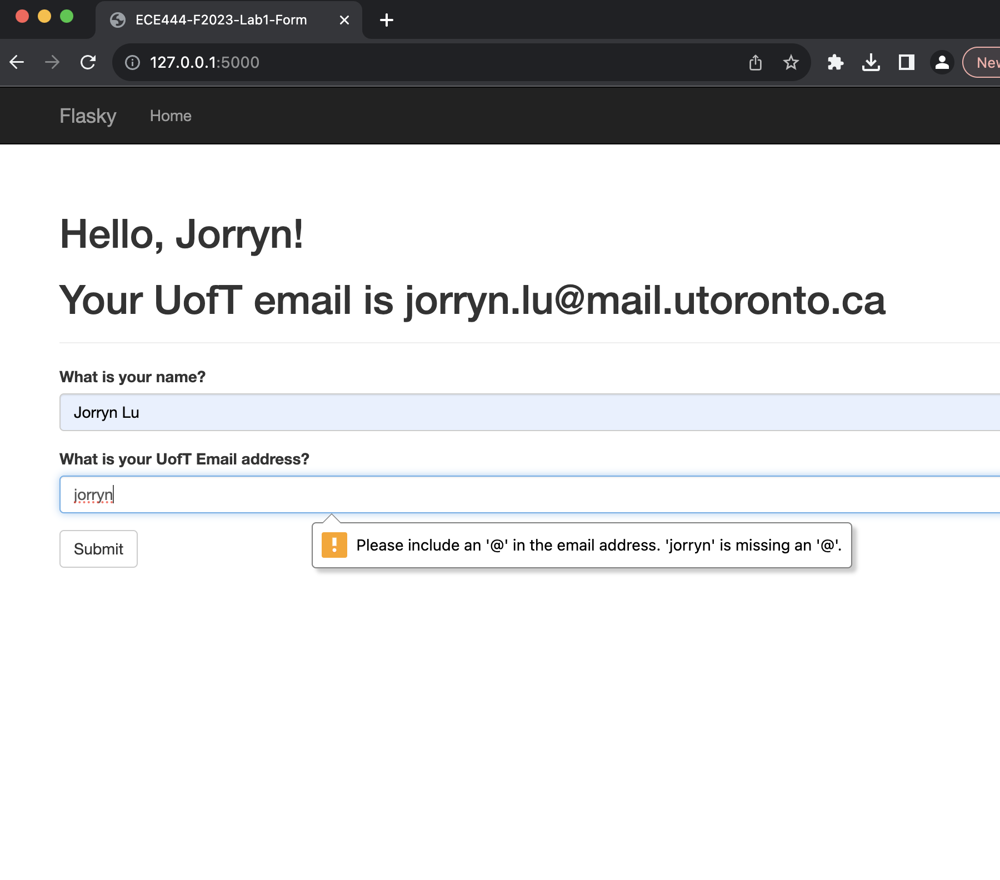
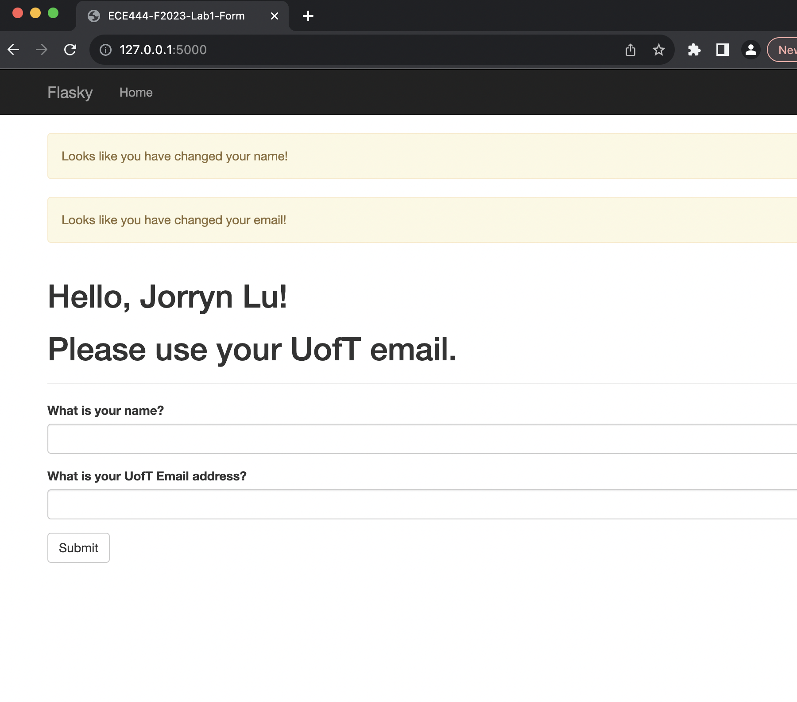

# Jorryn Lu
ECE444 Fall 2023 Lab 1 - Flask

This repo is a clone of https://github.com/miguelgrinberg/flasky

## Activity 1
Install virtual environment and flask on your local machine.

    

## Activity 2
Replay example 2-1 and 2-2 of the textbook

    Screenshot of Activity 2-2 Hello,Jorryn! 
     

## Activity 3
Add navbar and date time to index page

    

## Activity 4
Implement form and add name and email fields

    Screenshot of Activity 4-1 Initial Program Startup 
     
    Screenshot of Activity 4-2 Enter first name and valid uoft email 
     
    Screenshot of Activity 4-3 Enter invalid email address 
     
    Screenshot of Activity 4-4 Enter non-uoft email address 
     

