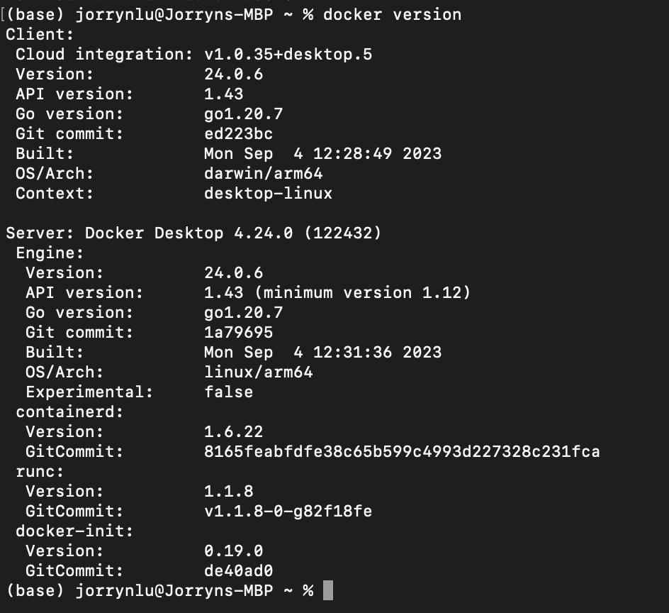

# Jorryn Lu
ECE444 Fall 2023 Lab 3 - Docker

This repo is a clone of https://github.com/miguelgrinberg/flasky

## Activity 1
Create the lab3 branch and pull the code
Set lab3 as the default branch on github

## Activity 2
Docker Installation

    

