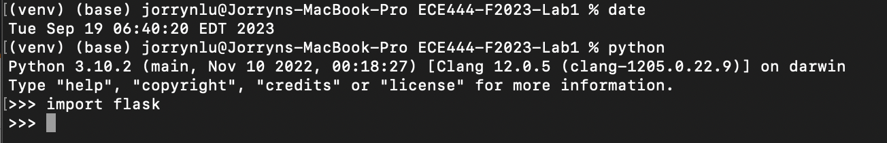
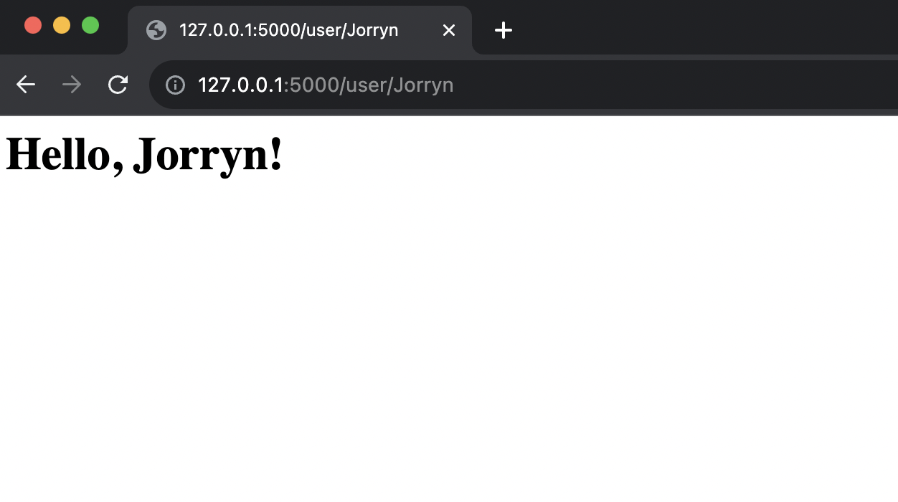

# Jorryn Lu
ECE444 Fall 2023 Lab 1 - Flask

This repo is a clone of https://github.com/miguelgrinberg/flasky

## Activity 1
Install virtual environment and flask on your local machine.

    

## Activity 2
Replay example 2-1 and 2-2 of the textbook

    Screenshot of Activity 2-2 Hello,Jorryn! 
     

