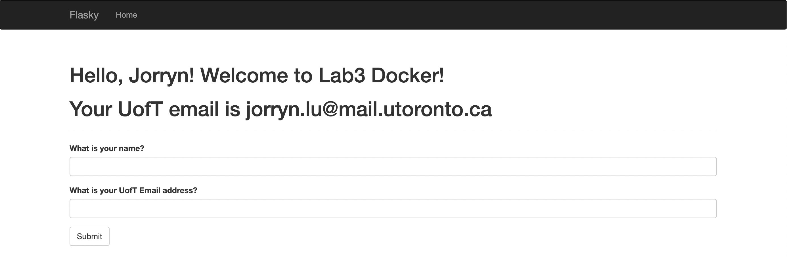

# Jorryn Lu
ECE444 Fall 2023 Lab 3 - Docker

This repo is a clone of https://github.com/miguelgrinberg/flasky

## Activity 1
Create the lab3 branch and pull the code
Set lab3 as the default branch on github

## Activity 2
Docker Installation

    

## Activity 3
Getting things ready locally
Change “Hello [your name]!” to “Hello [your name]! Welcome to Lab3 Docker!”

    

## Activity 4
Building and running the docker image locally

    Screenshot of the log message for the 3 commands used 
     
    Screenshot of the running application via docker 
    

